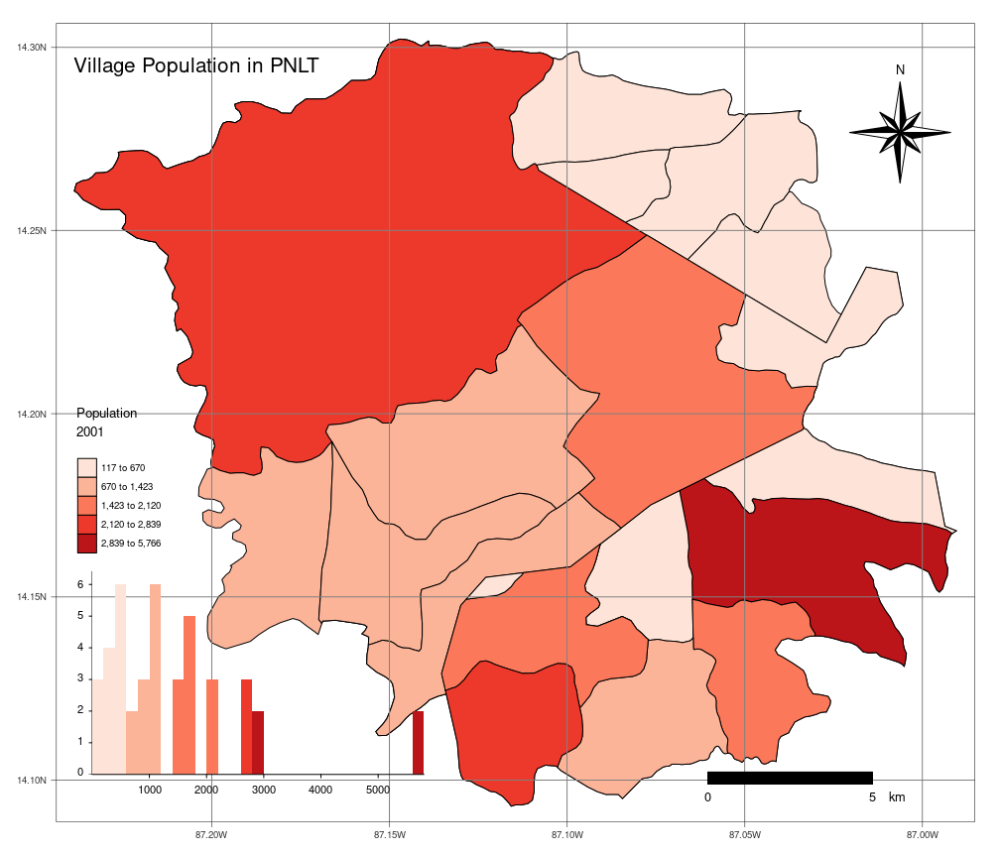

# pnlt 

[](https://www.r-project.org/)
[](https://www.tidyverse.org/lifecycle/#stable)
[](https://github.com/Naereen/StrapDown.js/blob/master/LICENSE)
[](https://github.com/klauswiese/pnlt/commits)


**La Tigra** was declared a National Park in 1980, although it has existed as a protected area since the 70s, it is located in the Department of Francisco Morazán, in central Honduras, northeast of Tegucigalpa; have a total area of 24,040 hectares. Currently the PNLT is co-managed by Instituto de Conservación Forestal (ICF) and Fundación Amigos de **La Tigra** (AMITIGRA), in the past the municipalities of Santa Lucia, Valle de Ángeles and San Juan de Flores were also co-managers of the Park.

The package pnlt is a compendium of spatial data from **La Tigra** National Park (PNLT by its acronym in Spanish), Honduras. This package can be install with:

```r
library(devtools)
install_github("klauswiese/pnlt")
```

All spatial data is an [**sf** object](https://r-spatial.github.io/sf/) with geographic coordinate reference system (EPSG:4326), here is a list of available objects:

## Administrative limits

| # | sf object | Details | Scale | Geometry | Source |
| :---: | :---: | :---: | :---: | :---: | :---: |
| 1 | Communities | Groups of houses and farms | Unknown | point | INE 2001|
| 2 | Villages | Limits from villages | Unknown | polygon | INE 2001 |
| 3 | Municipalities | Limits of 4 municipalities that convey in **La Tigra** | Unknown | polygon | INE 2001| 
| 4 | Departments | Francisco Morazán department | Unknown | polygon | INE 2001| 
| 5 | PNLT | National park limits from 1980 |Unknown |polygon | Gaceta 1980 |

## Development structures 

| # | sf object | Details | Scale | Geometry | Source |
| :---: | :---: | :---: | :---: | :---: | :---: |
| 1 | Water intake structures| Water micro dams | Unknown | polygon | AMITIGRA | 
| 2 | Schools | Schools location within La Tigra | Unknown | point | Secretaría de Educación |
| 3 | Trails | Turistic trails | Unknown | line | AMITIGRA |
| 4 | Visitors Centers | Centers with personal from AMITIGRA | Unknown | point | AMITIGRA |
| 5 | Roads | Road network with a development classification | Unknown | line | SOPTRAVI 2000 |

## Natural resources

| # | sf object | Details | Scale | Geometry | Source |
| :---: | :---: | :---: | :---: | :---: | :---: |
| 1 | Microbasins | Derived from the 30 meters SRTM digital elevation model | 1:114,000 | polygon | AMITIGRA 2020 | 
| 2 | Holdridge | Holdrige Life Zone Classification | 1:1,000,000 | polygon | Holdridge 1970 |
| 3 | Rivers | Water bodies | 1:50,000 | line | IGN |
| 4 | LULC2020 | Land use and land cover for year 2020 | 10 meters pixel | polygon | AMITIGRA 2020 |

## Fires

| # | sf object | Details | Scale | Geometry | Source |
| :---: | :---: | :---: | :---: | :---: | :---: |
| 1 | Fires1998 | Fires from year 1998 | 30 meters pixel | polygon | K. Wiese 2020 |
| 2 | Fires2000 | Fires from year 2000 | 30 meters pixel | polygon | K. Wiese 2020 |
| 3 | Fires2001 | Fires from year 2001 | 30 meters pixel | polygon | K. Wiese 2020 |
| 4 | Fires2011 | Fires from year 2011 | 30 meters pixel | polygon | K. Wiese 2020 |
| 5 | Fires2020 | Fires from year 2020 | 10 meters pixel | polygon | K. Wiese 2020 |


## Miscellaneous

| # | sf object | Details | Scale | Geometry | Source |
| :---: | :---: | :---: | :---: | :---: | :---: |
| 1 | Hills | Hills names and elevation | 1:50,000 | point | IGN |
| 2 | Site Names | Outstanding names | 1:50,000 | point | IGN |


# Usage

```r
# load pnlt package 
library(pnlt)

# tmap to plot data
library(tmap)

tm_shape(Villages) +
  tm_polygons(
    "POBTOT2001",
    border.col = "black",
    title = "Population \n2001",
    palette = "Reds",
    alpha = 0.7,
    legend.hist = TRUE,
    legend.is.portrait = TRUE,
    legend.z = 1
  ) +
  tm_layout(
    "Village Population in PNLT",
    legend.title.size=1,
    legend.text.size = 0.6,
    legend.position = c("left","bottom"),
    legend.bg.alpha = 1) +
  tm_compass() +
  tm_scale_bar()
```




***
# Credits
Hexagon Sticker created using package [hexSticker](https://github.com/GuangchuangYu/hexSticker) by [Guangchuang YU](https://yulab-smu.top)

***
