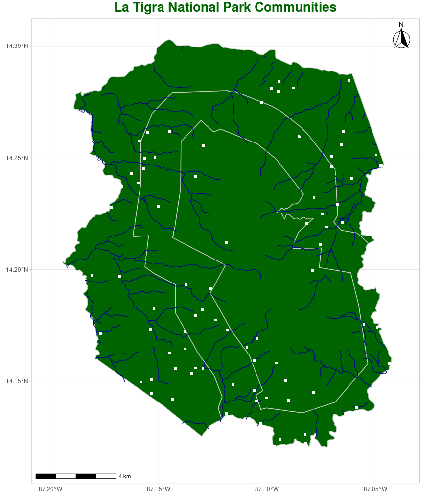

# pnlt 

<!-- badges: start -->
[](https://www.r-project.org/)
[](https://www.repostatus.org/#active)
[](https://www.tidyverse.org/lifecycle/#stable)
[](https://github.com/Naereen/StrapDown.js/blob/master/LICENSE)
[](https://github.com/klauswiese/pnlt/commits)
<!-- badges: end -->

**La Tigra** was declared a National Park in 1980, although it has existed as a protected area since the 70s, it is located in the Department of Francisco Morazán, in central Honduras, northeast of Tegucigalpa; have a total area of 24,040 hectares. Currently the PNLT is co-managed by Instituto de Conservación Forestal (ICF) and Fundación Amigos de **La Tigra** (AMITIGRA), in the past the municipalities of Santa Lucia, Valle de Ángeles and San Juan de Flores were also co-managers of the Park.

The package pnlt is a compendium of spatial data from **La Tigra** National Park (PNLT by its acronym in Spanish), Honduras. This package can be install with:

```r
#install.packages("devtools")
library(devtools)
install_github("klauswiese/pnlt")
```

All spatial data is an [**sf** object](https://r-spatial.github.io/sf/) with geographic coordinate reference system (EPSG:4326), here is a list of available objects:

## Administrative limits

| # | sf object | Details | Scale | Geometry | Source |
| :---: | :---: | :---: | :---: | :---: | :---: |
| 1 | Communities | Groups of houses and farms | Unknown | point | INE 2001|
| 2 | Villages | Limits from villages | Unknown | polygon | INE 2001 |
| 3 | Municipalities | Limits of 4 municipalities that convey in **La Tigra** | Unknown | polygon | INE 2001| 
| 4 | Departments | Francisco Morazán department | Unknown | polygon | INE 2001| 
| 5 | PNLT | National park limits from 1980 |Unknown |polygon | Gaceta 1980 |

## Development structures 

| # | sf object | Details | Scale | Geometry | Source |
| :---: | :---: | :---: | :---: | :---: | :---: |
| 1 | Water intake structures| Water micro dams | Unknown | polygon | AMITIGRA | 
| 2 | Schools | Schools location within La Tigra | Unknown | point | Secretaría de Educación |
| 3 | Trails | Turistic trails | Unknown | line | AMITIGRA |
| 4 | Visitors Centers | Centers with personal from AMITIGRA | Unknown | point | AMITIGRA |
| 5 | Roads | Road network with a development classification | Unknown | line | SOPTRAVI 2000 |

## Natural resources

| # | sf object | Details | Scale | Geometry | Source |
| :---: | :---: | :---: | :---: | :---: | :---: |
| 1 | Microbasins | Derived from the 30 meters SRTM digital elevation model | 1:114,000 | polygon | AMITIGRA 2020 | 
| 2 | Holdridge | Holdrige Life Zone Classification | 1:1,000,000 | polygon | Holdridge 1970 |
| 3 | Rivers | Water bodies | 1:50,000 | line | IGN |
| 4 | LULC2020 | Land use and land cover for year 2020 | 10 meters pixel | polygon | AMITIGRA 2020 |

## Fires

| # | sf object | Details | Scale | Geometry | Source |
| :---: | :---: | :---: | :---: | :---: | :---: |
| 1 | Fires1998 | Fires from year 1998 | 30 meters pixel | polygon | K. Wiese 2020 |
| 2 | Fires2000 | Fires from year 2000 | 30 meters pixel | polygon | K. Wiese 2020 |
| 3 | Fires2001 | Fires from year 2001 | 30 meters pixel | polygon | K. Wiese 2020 |
| 4 | Fires2011 | Fires from year 2011 | 30 meters pixel | polygon | K. Wiese 2020 |
| 5 | Fires2020 | Fires from year 2020 | 10 meters pixel | polygon | K. Wiese 2020 |


## Miscellaneous

| # | sf object | Details | Scale | Geometry | Source |
| :---: | :---: | :---: | :---: | :---: | :---: |
| 1 | Hills | Hills names and elevation | 1:50,000 | point | IGN |
| 2 | Site Names | Outstanding names | 1:50,000 | point | IGN |


# Usage

## [tmap](https://github.com/mtennekes/tmap) mapping

```r
# Libraries ----  
library(pnlt) #load pnlt package 
library(tmap) #tmap for mapping

#plot villages from PNLT
tm_shape(Villages
)  +
  tm_layout(
    "Village Population in PNLT",
    legend.title.size=1,
    legend.text.size = 0.6,
    legend.position = c("left","bottom"),
    legend.bg.alpha = 1
    ) +
  tm_fill("POBTOT2001",
    border.col = "black",
    style = 'jenks',
    title = "Population \n2001",
    palette = "Reds",
    legend.hist = TRUE,
    legend.z = 1
  ) + 
  tm_borders(col="black"
  ) +
  tm_compass(position = c(0.85,0.8), 
             type = "8star"
             ) +
  tm_scale_bar(position = c(0.7,0),
               lwd = 0.4,
               breaks = c(0,5),
               color.light = "black",
               text.size = 0.8
               ) +
  tm_grid(labels.cardinal = TRUE
  )
```

<p align="center">

</p>

***
## [ggplot2](https://ggplot2.tidyverse.org/) mapping

```r
# Libraries ----  
library(pnlt) #load pnlt package 
library(ggplot2) #ggplot2 for mapping
library(ggspatial) #accessories to ggplot2

#plot communities from PNLT
ggplot() + 
  geom_sf(data = PNLT, 
          fill = "darkgreen", 
          color = "grey80"
          ) +
  geom_sf(data = Rivers, 
          color = 'darkblue', 
          size = 0.5
          ) +
  geom_sf(data = Communities, 
          color="white",
          shape=15, 
          size=2,
          stroke=FALSE
          ) +
  theme_light() + 
  coord_sf() + 
  guides( colour = guide_legend()
  ) +
  ggtitle('La Tigra National Park Communities') +
  theme(plot.title = element_text(size= 20, 
                              hjust=0.5, 
                              color = 'darkgreen',
                              face = 'bold')
  )  +
  annotation_scale() +
  annotation_north_arrow(location = "tr", 
                         which_north = "true", 
                         style = north_arrow_fancy_orienteering
                         )
```

<p align="center">

</p>

## Convert **sf objects** to [gpkg](https://www.geopackage.org/) format

Maybe some users will like to use this spatial data in other software like [QGIS](https://www.qgis.org/en/site/), this can be done covnerting from [rda](https://www.loc.gov/preservation/digital/formats/fdd/fdd000470.shtml) format to other spatial data formats such as [gpkg](https://www.geopackage.org/). The function **downloadLaTigra()** make this possible in one step. The data will be download into your working directory in a folder named **PNLTdata**, 5 gpkg spatial databases with the thematic groups used in the package.

```r
library(pnlt) #load spatial data package
getwd() #Will give you the directory in your computer where the data will be download.


#call funtion to download information into PNLTdata folder in your working directory
downloadLaTigra()
```


***
# Credits
Hexagon Sticker created using package [hexSticker](https://github.com/GuangchuangYu/hexSticker) by [Guangchuang YU](https://yulab-smu.top)

***
